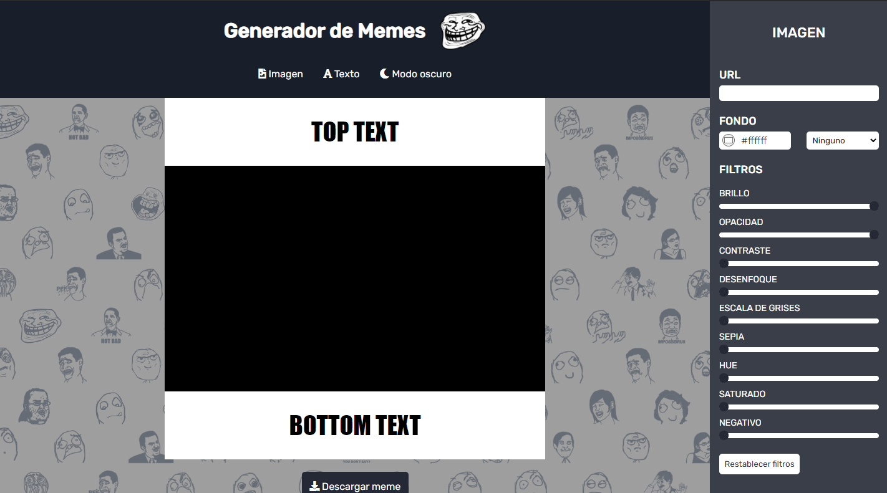
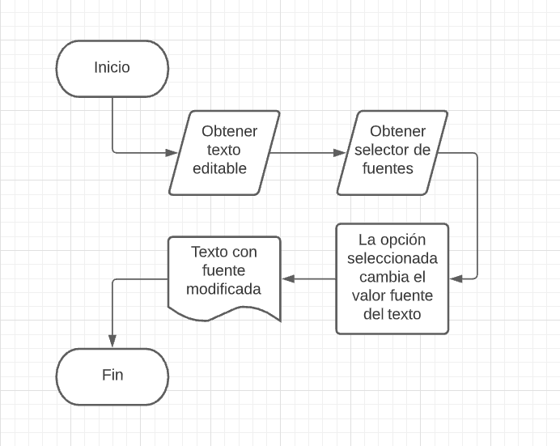

# 🎭 Generador de memes

### Este proyecto es el trabajo final del modulo-02, del cursado de Desarrollo Web Frontend de ADA. El mismo trata de un página web que consiste en la creación y personalización de memes de manera sencilla, intuitiva y online.

 

### 🔍 Podes visualizar el generador haciendo click en este [enlace](https://milenagimenez.github.io/generador-de-memes/) o en [este](https://stupefied-goodall-3afb8a.netlify.app/)

 

### 📎 Este proyecto no necesita la intalación de ninguna dependencia, por ahora!

 

***

### 🚀 Este debería ser el resultado final de tu instalación! 

 

 

***

## 📜 Pseudocódigo y DFD
 

### ¿Cómo cambiar la fuente tipográfica de tu meme?

 

1. Obtener el texto a modificar su tipografía.
2. Obtener selector con opciones de fuentes tipográficas.
3. Al clicar una opción determinada del selector, la tipográfia del texto cambia a la misma.
4. Se visualizará el resultado en la imagen del meme.

 

***
*Hecho por [Milena Gimenez 🌼](https://github.com/MilenaGimenez)*

 